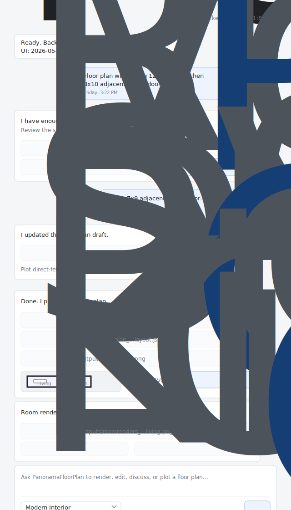
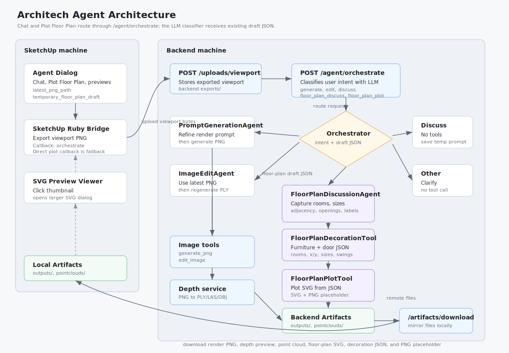
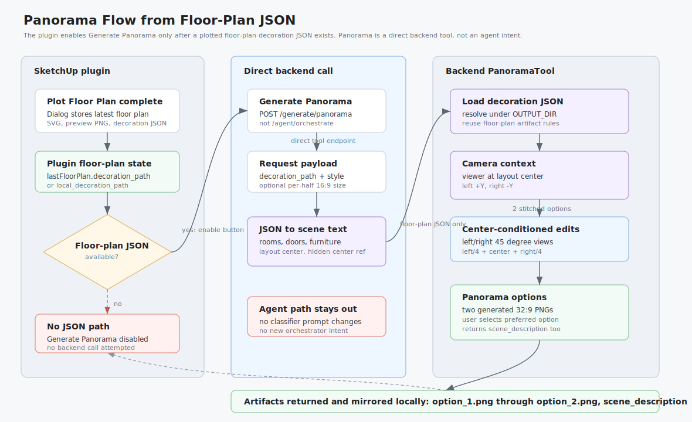

# SketchUp Agentic text2image Plugin

## Intro

SketchUp Agentic text2image Plugin is a SketchUp extension backed by local FastAPI services for agentic architectural rendering. From the SketchUp dialog, a user can ask for a render, edit the latest generated image, discuss a design direction, or generate a color point-cloud artifact from a PNG.

The current pipeline can:

- Upload the active SketchUp viewport to a local or remote backend.
- Generate or edit PNG render images with the configured render provider.
- Convert generated PNGs into colored PLY point clouds through the depth service.
- Route dialog messages through `/agent/orchestrate` so generate, edit, discuss, floor-plan discussion, plotting, room-render generation, and clarification flows are handled by the backend instead of frontend keyword checks.
- Discuss floor-plan requirements, keep the structured draft in dialog state, then use Plot Floor Plan to send that draft back through `/agent/orchestrate` for LLM-supported decoration JSON and SVG plotting.
- Generate room-level interior PNGs from the plotted floor-plan decoration JSON through the same backend orchestrator flow.
- Generate a whole-plan panorama directly from the plotted floor-plan decoration JSON through `/generate/panorama`.
- Download generated backend artifacts back to the SketchUp machine for preview, reveal, and import actions.

Detailed endpoint contracts, coordinate conventions, limits, and implementation notes live in `docs/`.

## Install

1. Create or update `.env`:

   ```env
   BACKEND_PORT=8000
   BACKEND_HOST=127.0.0.1
   ARCHITECH_RENDER_BACKEND_URL=http://127.0.0.1:8000
   DEPTH_SERVICE_PORT=8001
   RENDER_PROVIDER=openai
   OPENAI_API_KEY=your-openai-api-key
   OPENAI_IMAGE_MODEL=gpt-image-1.5
   AGENT_MODEL=gpt-4.1-mini
   DEPTH_MODEL=depth-anything/Depth-Anything-V2-Metric-Indoor-Small-hf
   ```

2. Start the backend and depth service:

   ```bash
   docker compose up --build
   ```

3. Check services:

   ```bash
   curl http://127.0.0.1:8000/health
   curl http://127.0.0.1:8001/health
   ```

   Used ports:

   | Service | Default Port | URL |
   | --- | ---: | --- |
   | Backend API | `8000` | `http://127.0.0.1:8000` |
   | Depth service | `8001` | `http://127.0.0.1:8001` |

4. To use a backend running on another machine, set the SketchUp client URL:

   ```env
   ARCHITECH_RENDER_BACKEND_URL=http://192.168.1.50:8000
   ```

5. Install the SketchUp extension by copying these into SketchUp's Plugins folder:

   ```text
   sketchup_plugin/architech_ai_renderer.rb
   sketchup_plugin/architech_ai_renderer/
   ```

6. Restart SketchUp, then open:

   ```text
   Extensions -> AI Render Assistant
   ```

The dialog sends prompts with the `Chat` button. The keyboard shortcut also works without a visible label: `Cmd+Enter` on macOS or `Ctrl+Enter` on Windows/Linux.

UI example:



## Project Structure

```text
backend/
  FastAPI gateway, render providers, image editing, agent orchestration,
  floor-plan plotting, prompt definitions, artifact upload/download, and backend tests.

depth_service/
  Depth Anything V2 metric model service boundary,
  RGB-D to PLY/LAS/OBJ generation, and depth-service tests.

sketchup_plugin/
  SketchUp Ruby extension, HtmlDialog UI, viewport export, backend client,
  artifact download, reveal/import callbacks, and style presets.

docs/
  Product spec, implementation notes, architecture diagram, panorama flow,
  and current UI mock.

examples/
  Example render request/response payloads.

exports/
outputs/
pointclouds/
  Local runtime artifact folders.
```

Key files:

- `backend/prompts.py`: agent system prompts, image prompts, tool descriptions, intent-classifier prompt, and prompt message builders.
- `backend/orchestrator.py`: generate/edit/discuss/floor-plan/other routing for dialog requests.
- `backend/panorama_tool.py`: direct floor-plan JSON to panorama image tool.
- `backend/agent_pipeline.py`: LangChain/OpenAI tool-calling path and deterministic fallback.
- `depth_service/service.py`: image-depth projection and point-cloud writers.
- `sketchup_plugin/architech_ai_renderer/main.rb`: SketchUp dialog callbacks and import/reveal behavior.
- `sketchup_plugin/architech_ai_renderer/dialog.html`: agent chat UI.

## Agent Workflow



Render and edit flows export the SketchUp viewport through the Ruby bridge, upload it to the backend, call `/agent/orchestrate`, run the selected tool path, download artifacts, then preview/reveal/import them locally. Floor-plan chat prompts, `Plot Floor Plan`, and `Generate Room Renders` use a direct HtmlDialog `fetch` to `${backend_url}/agent/orchestrate`; these flows send draft or decoration JSON state and do not upload the viewport. The dialog then downloads SVG, PNG, and room-render artifacts through `/artifacts/download` for local previews.

Panorama generation is a direct backend tool flow, enabled only after the plugin has a plotted floor-plan decoration JSON path:



The plugin calls `/generate/panorama` directly for this path; it does not add an `/agent/orchestrate` intent. The backend converts the floor-plan JSON into a whole-layout scene description and renders two direct 16:9 panorama options from the floor-plan center so the user can select the preferred option.

SketchUp-local actions still run through Ruby callbacks because they need access to `Sketchup.active_model`: opening the large floor-plan viewer for local files, importing render PNGs, revealing point-cloud files, and importing supported point-cloud formats.

`/agent/orchestrate` classifies each message into rendering, editing, discussion, floor-planning, room-rendering, or clarification intents:

- `generate`: refine the text-to-image direction, generate a PNG, then generate a point cloud.
- `edit`: use the latest generated PNG, call the image edit tool, then regenerate the point cloud.
- `discuss`: update the temporary text-to-image direction without calling render tools.
- `floor_plan_discuss`: update a structured floor-plan draft and report missing required details. The LLM intent classifier receives the existing draft JSON so short follow-up prompts such as `Office 7x9 adjacent with a door` can continue the same draft.
- `floor_plan_plot`: plot a complete floor-plan draft as SVG plus PNG preview artifacts through `FloorPlanDecorationTool` and `FloorPlanPlotTool`.
- `room_render_generate`: generate room-level interior PNGs from the latest floor-plan decoration JSON through the room render tool.
- `other`: ask for clarification or return a no-tool response.

The lower-level `/agent/run` endpoint still exists for direct PNG-to-point-cloud agent execution. It rejects underspecified conversational input, uses LangChain/OpenAI tool calling when configured, and falls back to deterministic PNG then point-cloud orchestration when the model path is unavailable.

Point-cloud output defaults to PLY. The current coordinate convention is:

```text
x = image horizontal
y = max_depth - depth
z = image vertical/up shifted so min(z) = 0
```

Generated point-cloud files can always be revealed locally. Direct PLY/LAS import is only enabled when the plugin can find a callable Scan Essentials Ruby import API; otherwise reveal the file and import it manually through Scan Essentials. OBJ import uses SketchUp's generic importer.

## More Documentation

- Product and endpoint spec: `docs/spec.md`
- Implementation checklist and verification notes: `docs/implementation.md`
- Agent architecture diagram: `docs/agent-architecture.svg`
- Panorama tool flow: `docs/panorama-flow.svg`
- Current SketchUp dialog mock: `docs/current-extension-ui.svg`

## Tests

```bash
docker compose run --rm backend pytest tests -q
docker compose run --rm depth-service pytest tests -q
```
