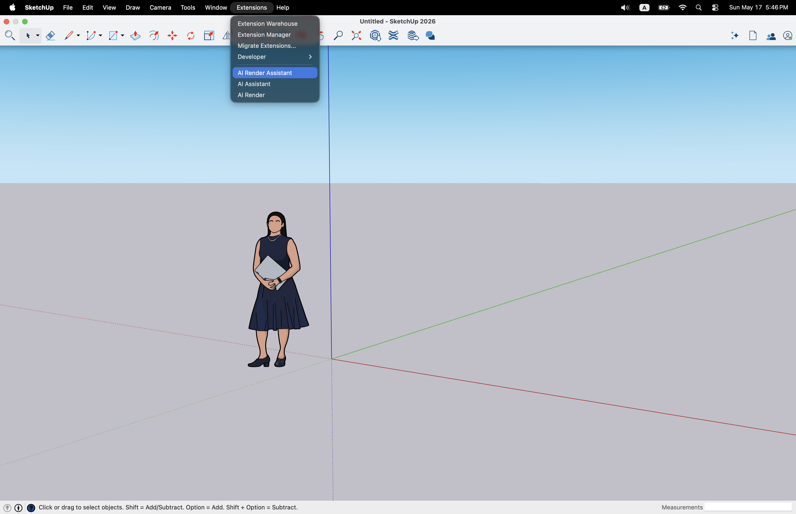
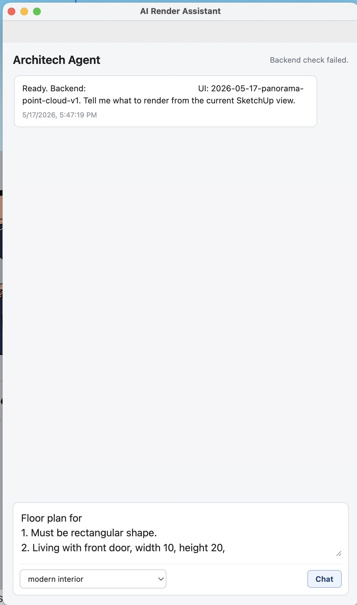
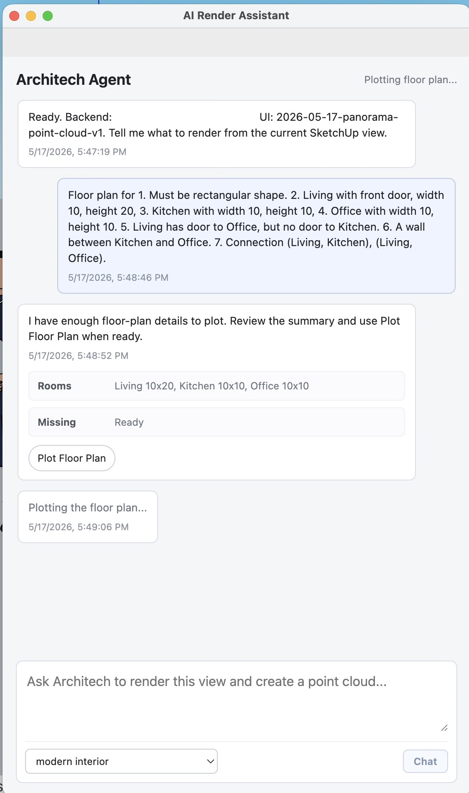
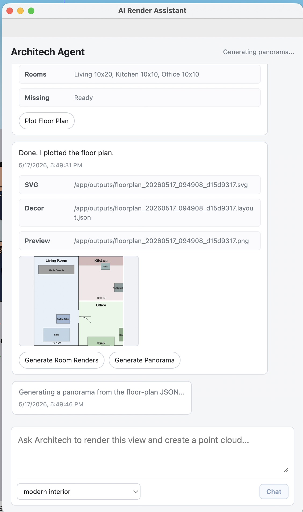
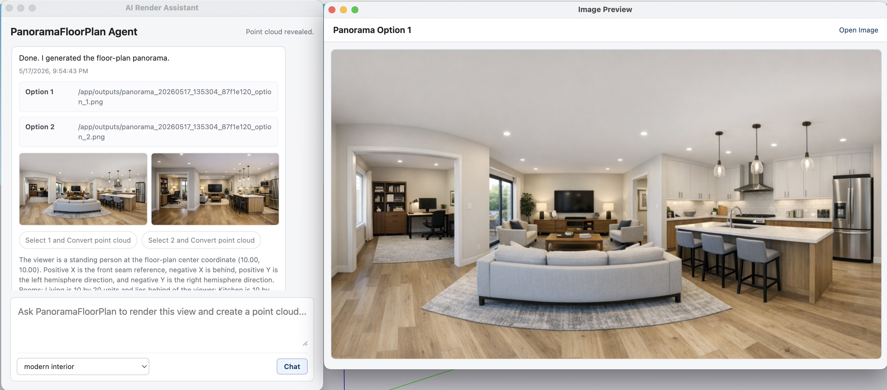
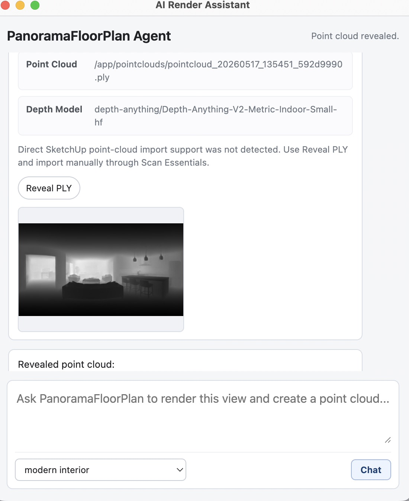

# Plugin Tutorial: Floor Plan to Panorama Point Cloud

This tutorial walks through the example SketchUp workflow shown in the screenshots in `docs/tutorial_asset/`. It covers opening the AI Render Assistant, describing a floor plan, plotting it, generating panorama options, converting the selected panorama into a point cloud, and importing the resulting PLY file.

## Prerequisites

Before starting, make sure the backend and depth service are running, the SketchUp extension is installed, and `OPENAI_API_KEY` is configured for the backend. The default local backend URL is:

```text
http://127.0.0.1:8000
```

If the backend runs on another machine, set `PANORAMA_FLOORPLAN_RENDER_BACKEND_URL` to that machine's backend URL before opening the extension.

## 1. Open the AI Render Assistant

In SketchUp, open the extension from:

```text
Extensions -> AI Render Assistant
```

The dialog starts with the current backend status and the prompt composer.



## 2. Enter the Floor-Plan Requirements

Use the chat box to describe the floor plan. This example uses three rooms and explicit adjacency constraints:

```text
Floor plan
1. Must be rectangular shape. 
2. Living with front door, width 10, height 20 
3. Kitchen with width 10, height 20
4. Office with width 10, height 10. 
5. Living has door to Office, but no door to Kitchen. 
6. A wall between Kitchen and Office. 
7. Connection (Living, Kitchen), (Living, Office).
```

Click `Chat`. The assistant parses the room requirements, stores the draft in the dialog state, and shows `Plot Floor Plan` once the draft is complete.



## 3. Plot the Floor Plan

Click `Plot Floor Plan`. The dialog sends the structured floor-plan draft to `/agent/orchestrate`, where the backend creates the floor-plan decoration JSON, SVG, and PNG preview artifacts.

When plotting finishes, the assistant displays the generated artifact paths and a preview of the floor plan. The preview also enables the next actions, including room renders and panorama generation.



## 4. Generate Panorama Options

Click `Generate Panorama`. This calls `/generate/panorama` directly with the plotted floor-plan decoration JSON. The backend describes the whole layout from the floor-plan center and generates two 16:9 panorama options.



## 5. Select a Panorama and Convert It to a Point Cloud

Review the two panorama options and choose one. Click the matching `Select ... and Convert point cloud` button. The plugin sends the selected panorama image through the depth pipeline to estimate depth and generate a colored PLY point cloud.



## 6. Reveal or Import the Point Cloud

When the point-cloud step finishes, the assistant shows the generated PLY path and a depth preview. The plugin always offers `Reveal PLY` so you can find the downloaded point-cloud file on the SketchUp machine.



## 7. Import the PLY Result

Direct PLY import depends on SketchUp having a compatible point-cloud importer available, such as Scan Essentials. If the plugin detects a supported local import API, use the import action in the assistant dialog to bring the point cloud into the active SketchUp model.

If direct import is not available, use the manual path:

1. Click `Reveal PLY` in the assistant dialog.
2. In SketchUp, open the Scan Essentials import workflow.
3. Select the revealed `.ply` file from the local `pointclouds/` folder.
4. Confirm the import settings and place the point cloud in the model.

The message `Direct SketchUp point-cloud import support was not detected` means the PLY file was still generated successfully; it only means the plugin could not find a callable SketchUp import adapter. Use `Reveal PLY` and import the file manually.

## Expected Result

At the end of this flow, the backend has generated:

- a plotted floor-plan SVG and PNG preview
- a floor-plan decoration JSON file
- two panorama PNG options
- a depth preview for the selected panorama
- a PLY point-cloud artifact

The generated files are stored by the backend under its configured runtime artifact folders and downloaded or revealed through the SketchUp plugin UI as needed.
